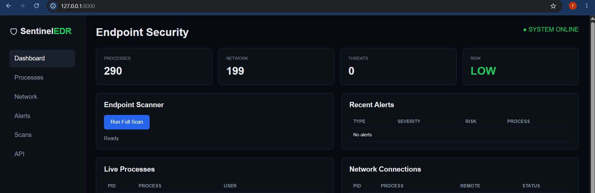
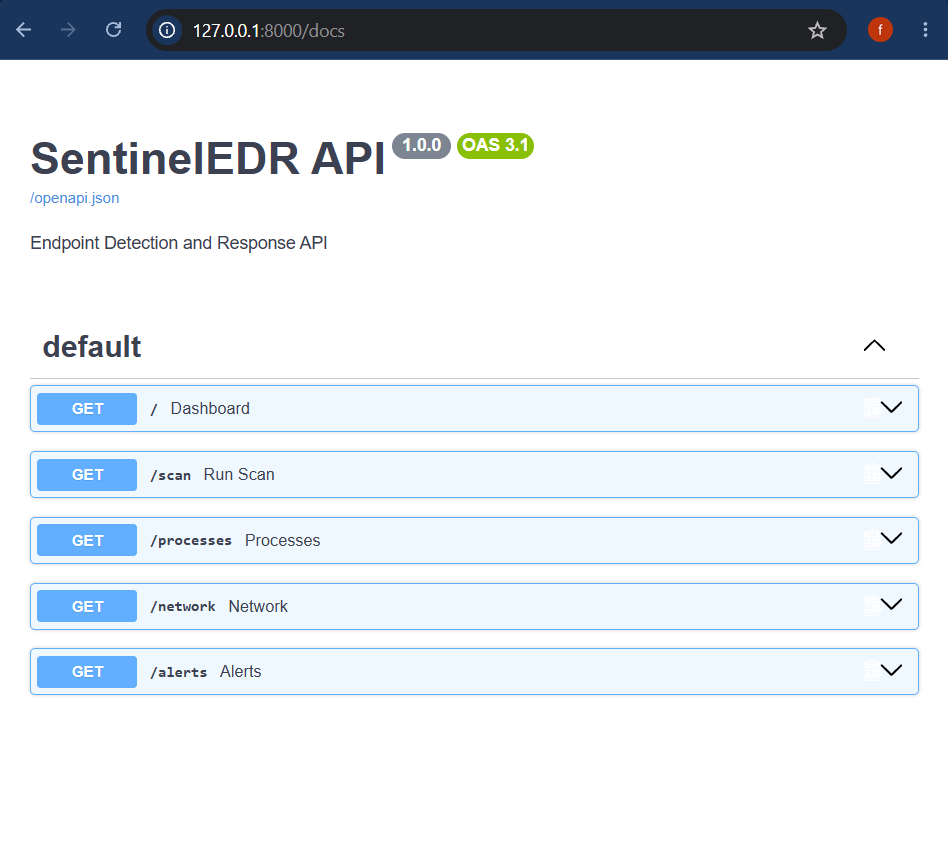

# 🛡️ SentinelEDR

**SentinelEDR** is a Python-based Endpoint Detection and Response (EDR) platform designed to monitor Windows endpoints, collect security telemetry, detect suspicious activity, classify security risks, and expose endpoint information through a FastAPI web interface.

The project demonstrates practical defensive-security concepts including endpoint monitoring, rule-based threat detection, risk scoring, alert persistence, REST APIs, automated testing, and continuous integration.

---

## 🎯 Project Goals

SentinelEDR was built to demonstrate how a lightweight endpoint security platform can:

* Monitor running Windows processes
* Monitor active network connections
* Identify potentially suspicious activity
* Assign risk levels to detected events
* Store security alerts
* Expose security telemetry through an API
* Provide a web-based security dashboard
* Automatically test detection logic through CI

---

## ✨ Features

### Endpoint Monitoring

* Live Windows process monitoring
* Process ID, name, and user information
* Active network connection monitoring
* Remote IP address, port, and connection-state visibility

### Threat Detection

* Suspicious process detection
* Suspicious PowerShell command detection
* Suspicious executable-location detection
* Suspicious network-port detection
* Rule-based security detections
* Risk-based alert classification

### Security Platform

* SQLite alert storage
* FastAPI REST API
* Interactive endpoint security dashboard
* Endpoint scanning
* JSON-based API responses

### Development & Quality

* Automated tests with `pytest`
* GitHub Actions CI
* Modular Python architecture
* Git-based version control

---

## 🏗️ Architecture

```text
                         ┌──────────────────────┐
                         │   Windows Endpoint   │
                         └──────────┬───────────┘
                                    │
                     ┌──────────────┴──────────────┐
                     │                             │
                     ▼                             ▼
             ┌───────────────┐             ┌───────────────┐
             │Process Monitor│             │Network Monitor│
             └───────┬───────┘             └───────┬───────┘
                     │                             │
                     ▼                             ▼
             ┌───────────────┐             ┌───────────────┐
             │Process Detector│             │Network Detector│
             └───────┬───────┘             └───────┬───────┘
                     │                             │
                     └──────────────┬──────────────┘
                                    ▼
                           ┌─────────────────┐
                           │   Alert Engine  │
                           └────────┬────────┘
                                    │
                                    ▼
                           ┌─────────────────┐
                           │   Risk Engine   │
                           └────────┬────────┘
                                    │
                                    ▼
                           ┌─────────────────┐
                           │    SQLite DB    │
                           └────────┬────────┘
                                    │
                                    ▼
                           ┌─────────────────┐
                           │    FastAPI      │
                           │   REST API      │
                           └────────┬────────┘
                                    │
                                    ▼
                           ┌─────────────────┐
                           │ Security        │
                           │ Dashboard       │
                           └─────────────────┘
```

---

## 📸 Dashboard

SentinelEDR provides a web-based endpoint security console for viewing endpoint status, process telemetry, network connections, detected threats, risk level, and scan results.



---

## 🔍 Endpoint Scan

The platform can perform an endpoint scan and report the current security state of the monitored system.


---

## 🔌 API Documentation

SentinelEDR exposes its security telemetry through a FastAPI REST API with interactive Swagger/OpenAPI documentation.



### API Endpoints

| Endpoint     | Method | Purpose                         |
| ------------ | ------ | ------------------------------- |
| `/`          | GET    | EDR dashboard                   |
| `/processes` | GET    | Retrieve running processes      |
| `/network`   | GET    | Retrieve network connections    |
| `/alerts`    | GET    | Retrieve stored security alerts |
| `/scan`      | GET    | Run an endpoint scan            |
| `/docs`      | GET    | Interactive API documentation   |

---

## 🚨 Detection Capabilities

SentinelEDR currently provides rule-based detection for potentially suspicious endpoint activity.

Examples include:

* Known suspicious process names
* Suspicious PowerShell command-line arguments
* Executables running from temporary directories
* Connections using suspicious ports such as `4444`, `5555`, and `1337`
* Brute-force login activity
* Password spraying behavior
* Privileged login activity

Detected events can be classified according to their calculated security risk.

---

## 🧪 Testing

Detection logic is tested using `pytest`.

Run the test suite:

```powershell
py -m pytest -v
```

The project includes automated tests covering detection behavior such as:

* Brute-force detection
* Password-spraying detection
* Privileged-login detection
* Normal-login behavior without false alerts

---

## 🔄 Continuous Integration

SentinelEDR uses **GitHub Actions** to automatically execute the test suite when changes are pushed or pull requests are created.

```text
Developer
    │
    ▼
 Git Push
    │
    ▼
GitHub Actions
    │
    ▼
Install Dependencies
    │
    ▼
Run pytest
    │
    ▼
Tests Passed ✓
```

---

## 📁 Project Structure

```text
SentinelEDR/
│
├── .github/
│   └── workflows/
│       └── tests.yml
│
├── app/
│   ├── core/
│   │   ├── parser.py
│   │   └── risk.py
│   │
│   ├── detectors/
│   │   ├── bruteforce.py
│   │   └── rules.py
│   │
│   ├── storage/
│   │   └── database.py
│   │
│   └── api.py
│
├── tests/
│   └── ...
│
├── main.py
├── README.md
└── .gitignore
```

---

## ⚙️ Technology Stack

| Technology     | Purpose                               |
| -------------- | ------------------------------------- |
| Python         | Core implementation                   |
| FastAPI        | REST API and web interface            |
| Uvicorn        | ASGI server                           |
| psutil         | Windows process and network telemetry |
| SQLite         | Alert persistence                     |
| pytest         | Automated testing                     |
| GitHub Actions | Continuous integration                |
| Git            | Version control                       |

---

## 🚀 Running SentinelEDR

Clone the repository and enter the project directory:

```powershell
git clone https://github.com/Fuzzy4-arch/SentinelEDR.git
cd SentinelEDR
```

Install dependencies:

```powershell
py -m pip install fastapi uvicorn psutil pytest
```

Start the API server:

```powershell
py -m uvicorn app.api:app --reload
```

Open the dashboard:

```text
http://127.0.0.1:8000/
```

Open the API documentation:

```text
http://127.0.0.1:8000/docs
```

Run the tests:

```powershell
py -m pytest -v
```

---

## 🔐 Security Considerations

SentinelEDR is a defensive security research and portfolio project.

When publishing screenshots or telemetry publicly:

* Do not expose Windows usernames
* Do not publish sensitive endpoint information
* Avoid exposing private network details unnecessarily
* Do not commit credentials, API keys, tokens, or secrets
* Keep local databases and runtime logs excluded from version control

The repository's `.gitignore` is used to prevent local runtime artifacts and sensitive environment files from being committed.

---

## 📈 Future Improvements

Potential future development includes:

* Real-time WebSocket telemetry
* Process-tree analysis
* Windows Event Log integration
* MITRE ATT&CK technique mapping
* IOC management
* IP/domain reputation checking
* Alert severity dashboards
* Authentication and role-based access control
* Persistent endpoint agents
* Centralized multi-endpoint monitoring
* Advanced behavioral detection

---

## ⚠️ Disclaimer

SentinelEDR is intended for cybersecurity education, defensive security research, experimentation, and portfolio demonstration.

It should not be considered a production-grade EDR solution. Detection rules may produce false positives or false negatives and should be validated before use in real environments.
